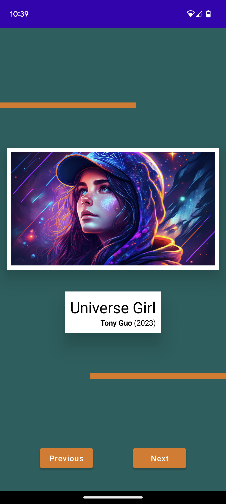
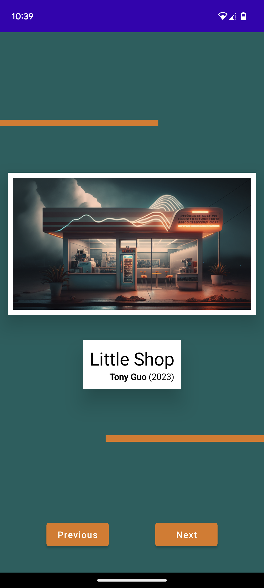
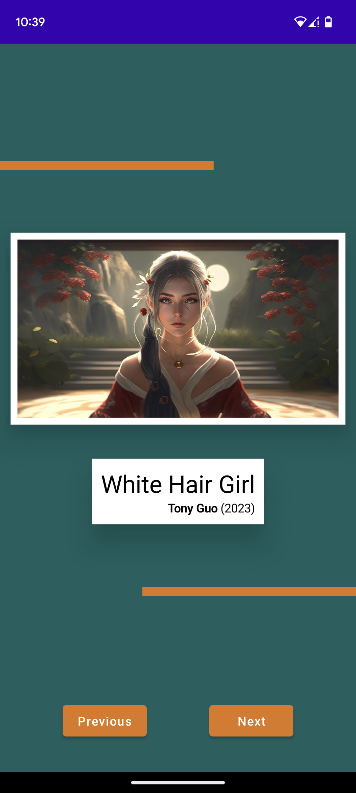

# ArtSpace

ArtSpace is an Android app that serves as a digital gallery, showcasing various artworks. The app utilizes Jetpack Compose to provide a modern and engaging user interface. The artwork displayed in the app is generated using Midjourney's AI Art generation.

## Dependencies

- Jetpack Compose: The modern UI toolkit for building native Android apps.
- Midjourney - AI Art Generation: Used for generating unique and captivating artworks.

## Screenshots

  

  

  

